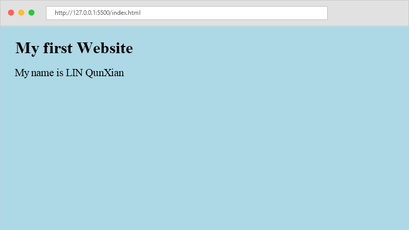

# MyWebsite

這是我在課堂上製作的第一個個人網頁，用來練習 HTML、CSS 以及 Git 和 GitHub 的版本控制。

## 專案介紹
說明：
* **為什麼製作這個專案？**  
  學習網頁製作基礎，並練習 Git 的基本操作（例如 git add, git commit, git push 等）。
* **主要功能是什麼？**  
  在網頁上顯示個人標題與姓名，並使用 CSS 設定背景顏色。

## 功能
* [x] 建立 index.html 網頁
* [x] 顯示大標題「My first Website」
* [x] 顯示我的名字「My name is LIN QunXian」
* [x] 使用 style.css 設定淺藍色背景
* [x] 使用 .gitignore 忽略不必要的檔案

## 使用技術
* HTML
* CSS
* Git
* GitHub

## 畫面展示
網頁畫面如下：



* 倉庫網址：[https://github.com/qunxianlin/mywebsite](https://github.com/qunxianlin/mywebsite)

## 使用方式
1. 下載專案：
```bash
git clone https://github.com/qunxianlin/mywebsite.git
```
2. 進入資料夾：
```bash
cd mywebsite
```
3. 用瀏覽器打開 `index.html` 即可查看。

## 作者
* 林群賢 (Qunxian Lin)
* GitHub: [qunxianlin](https://github.com/qunxianlin)